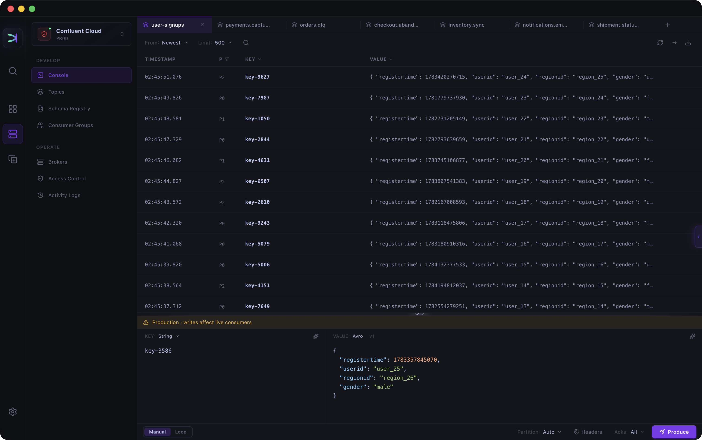

# Kafma

**The Kafka GUI client and desktop IDE.**

Debug faster. Close the gap between prod and dev. 
Intuitive. Simple. Beautiful.

[Website](https://kafma.app) · [Documentation](https://kafma.app/docs) · [Blog](https://kafma.app/blog) · [Pricing](https://kafma.app/pricing) · [Discussions](https://github.com/kafma-app/kafma/discussions) · [Issues](https://github.com/kafma-app/kafma/issues)

Read: [A New Kafka Viewer for a Better Debugging Workflow](https://kafma.app/blog/kafka-viewer-debugging-workflow)

## What's inside

- **Console** — One tab per topic: produce below, consume above. Live tail, Watch Group, automatic Avro/Protobuf decoding through Schema Registry, plus replay, forwarding, and JSON/CSV export.
- **Schemas** — Draft diffs against the live version, historical comparisons, mock data, and Lab validation before you publish.
- **Data Clone** — Copy a topic's configuration, schemas, and a slice of messages to another cluster, masking sensitive fields on the way without modifying the source cluster.
- **Topics, consumer groups, and brokers** — Manage topics, inspect lag and assignments, reset offsets, and browse configuration with an Overrides-only view.
- **Access control** — Browse Kafka ACLs read-only and simulate access against the rules visible through the Kafka Admin API.
- **Operational safety** — Read-only cluster connections, typed confirmation before cloning into production, and rollback of supported changes from the Activity Log.
- **Multi-cluster workspace** — Self-hosted Kafka, Confluent Cloud, and Amazon MSK with SASL (PLAIN, SCRAM, OAUTHBEARER), mTLS, or AWS IAM; pin favorites to Home and jump anywhere with global search.

## Download

Every download link below always points to the latest stable release.

| Platform              | Architecture  | File                                                                                                                   |
| --------------------- | ------------- | ---------------------------------------------------------------------------------------------------------------------- |
| macOS                 | Apple Silicon | [Kafma-mac-arm64.dmg](https://github.com/kafma-app/kafma/releases/latest/download/Kafma-mac-arm64.dmg)                 |
| macOS                 | Intel         | [Kafma-mac-x64.dmg](https://github.com/kafma-app/kafma/releases/latest/download/Kafma-mac-x64.dmg)                     |
| Windows               | x64           | [Kafma-windows-x64.exe](https://github.com/kafma-app/kafma/releases/latest/download/Kafma-windows-x64.exe)             |
| Windows               | ARM64         | [Kafma-windows-arm64.exe](https://github.com/kafma-app/kafma/releases/latest/download/Kafma-windows-arm64.exe)         |
| Linux · Debian/Ubuntu | x86_64        | [Kafma-linux-x86_64.deb](https://github.com/kafma-app/kafma/releases/latest/download/Kafma-linux-x86_64.deb)           |
| Linux · Fedora/RHEL   | x86_64        | [Kafma-linux-x86_64.rpm](https://github.com/kafma-app/kafma/releases/latest/download/Kafma-linux-x86_64.rpm)           |
| Linux · AppImage      | x86_64        | [Kafma-linux-x86_64.AppImage](https://github.com/kafma-app/kafma/releases/latest/download/Kafma-linux-x86_64.AppImage) |
| Linux · Debian/Ubuntu | ARM64         | [Kafma-linux-arm64.deb](https://github.com/kafma-app/kafma/releases/latest/download/Kafma-linux-arm64.deb)             |
| Linux · Fedora/RHEL   | ARM64         | [Kafma-linux-arm64.rpm](https://github.com/kafma-app/kafma/releases/latest/download/Kafma-linux-arm64.rpm)             |
| Linux · AppImage      | ARM64         | [Kafma-linux-arm64.AppImage](https://github.com/kafma-app/kafma/releases/latest/download/Kafma-linux-arm64.AppImage)   |

Every release includes [release-manifest.json](https://github.com/kafma-app/kafma/releases/latest/download/release-manifest.json) with SHA-256 checksums for every installer. Past versions are on the [Releases page](https://github.com/kafma-app/kafma/releases); full release notes are in the [Kafma changelog](https://kafma.app/changelog).

## First launch

- **macOS.** Signed with a Developer ID certificate and notarized by Apple. Open the DMG and drag Kafma into Applications.

- **Windows.** Installers are not code-signed, so Microsoft Defender SmartScreen may show "Windows protected your PC." Confirm that the installer was downloaded from this repository, then click **More info → Run anyway**. SHA-256 checksums are provided with every release for manual verification.

- **Linux.** DEB and RPM install through your system package manager. AppImage runs directly — `chmod +x Kafma-linux-*.AppImage` and double-click. None of the Linux packages are signed.

## Support

- **Ask a question or share feedback** → [Discussions](https://github.com/kafma-app/kafma/discussions)
- **Report a bug** → [Issues](https://github.com/kafma-app/kafma/issues)
- **Contact us directly** → [support@kafma.app](mailto:support@kafma.app)

## About

Kafma is a commercial product from [kafma.app](https://kafma.app). A free tier is available; Pro features require a license — see [Pricing](https://kafma.app/pricing) and [Terms](https://kafma.app/terms).

Kafma keeps itself up to date from this repository's releases; automatic updates can be turned off in Settings. Updates never send your license key, cluster configuration, or Kafka data — see the [privacy policy](https://kafma.app/privacy).

The application is proprietary software. This repository hosts release downloads and issue tracking; source code is not public.
